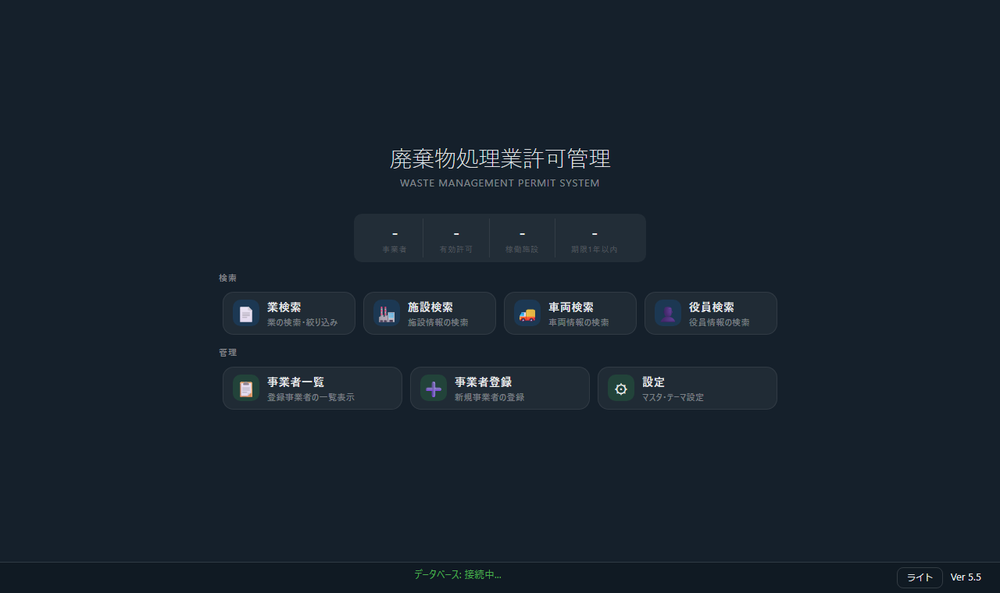

# 廃棄物処理業許可管理システム

HTA と Microsoft Access を使った、廃棄物処理業の許可・施設・車両・役員情報を管理するアプリです。

公的機関や金融機関のようにセキュリティ制約が強い環境での運用を前提にしています。追加ライブラリや常駐サービスを使わず、HTA と Access Database Engine で動く構成です。

## 起動直後の画面

起動すると、最初にホーム画面が表示されます。ここから検索、一覧、登録、設定へ移動します。



ホーム画面の上部には、登録済み事業者数、有効許可数、稼働施設数、期限が1年以内の許可数を表示します。通常業務では、まず「業検索」または「施設検索」から対象を探し、事業者詳細に入って許可・施設・車両・役員を確認、追加、変更します。

主な導線:

- `業検索`: 許可番号、事業者名、許可区分、有効期限、品目で許可を検索します。
- `施設検索`: 設置場所、許可番号、事業者名、施設種別で施設を検索します。
- `車両検索`: 登録番号または事業者名で車両を検索します。
- `役員検索`: 氏名、役職名、事業者名で役員を検索します。
- `事業者一覧`: 登録済み事業者を一覧し、詳細画面へ移動します。
- `事業者登録`: 新規事業者を登録します。
- `設定`: DBファイルの接続先、マスタ、データ補完、旧DBインポートを管理します。

## 起動方式

運用時に必要なのは HTA です。exe 化は前提にしていません。

- 配布対象は、基本的に `app.hta`, `app_logic.js`, Access DB (`.accdb`) です。
- `app_source.hta` は開発用の元ファイルです。必要に応じて `app.hta` を生成します。
- exe ラッパーが存在しても、セキュリティが厳しい現場では導入不可になることが多く、本システムでは意味を持ちません。
- 現状の構成では、HTA のみで起動できます。起動は `mshta.exe app.hta`、または `app.hta` の直接起動で行います。

`app.hta` を生成する場合:

```bat
python scripts\convert_hta.py
```

## Access Database Engine / Runtime の注意

このシステムは `.accdb` を ADODB 経由で開くため、PC側に Microsoft Access Database Engine または Access Runtime が必要です。特に 32bit / 64bit の違いに注意してください。

現在は 32bit 版を既定の前提にしています。

重要な点:

- HTA を実行する `mshta.exe` の bit 数と、インストール済みの Access Database Engine / Runtime の bit 数が一致している必要があります。
- 64bit Windows では、`C:\Windows\SysWOW64\mshta.exe` が 32bit 版、`C:\Windows\System32\mshta.exe` が 64bit 版です。名前が直感と逆に見えるため注意してください。
- 32bit 版 Access Runtime / Database Engine が入っている環境では、32bit 版の `mshta.exe` で起動してください。
- 64bit 版 Access Runtime / Database Engine しか入っていない環境では、64bit 版の `mshta.exe` で起動する必要があります。
- Office の bit 数と Access Runtime / Database Engine の bit 数が競合する場合があります。既存Officeが32bitなら32bit、64bitなら64bitで揃えるのが基本です。

32bit 既定で起動する例:

```bat
C:\Windows\SysWOW64\mshta.exe app.hta
```

64bit 環境で起動する例:

```bat
C:\Windows\System32\mshta.exe app.hta
```

DB接続時は、内部で `Microsoft.ACE.OLEDB.16.0`, `Microsoft.ACE.OLEDB.12.0`, `Microsoft.Jet.OLEDB.4.0` の順に接続を試します。ただし `.accdb` 運用では ACE OLEDB が必要です。Jet OLEDB は主に古い `.mdb` 向けです。

## 構成

- `app_source.hta`: HTA本体です。画面、CSS、イベント処理、ADODB実行を含みます。
- `app_logic.js`: SQLビルダー、バリデーション、共通ロジックです。
- `docs/`: 仕様、画面定義、DB設計などのドキュメントです。
- `tests/`: Jest、pytest、HTAレイアウト確認用のテストです。
- `scripts/`: HTA変換、静的チェック、ダミーデータ生成用スクリプトです。

## 公開リポジトリでの注意

このリポジトリは、画面・ロジック・テーブル構成を確認するための公開サンプルです。利用時は、同梱のサンプルDBまたは利用者が用意した Access DB を設定画面から指定して使います。

`.gitignore` では、環境ごとに生成される作業用フォルダや一時ファイルを除外しています。公開リポジトリには、再現に必要なソース、仕様、テスト、サンプル構成のみを置く方針です。

## テスト

JavaScript/HTA構造のテスト:

```bash
npm test -- --runInBand
```

DB接続を含むテスト:

```bash
npm run test:db
```

Access Database Engine やDB接続先がない環境では、DB接続が必要な pytest は skip されます。
